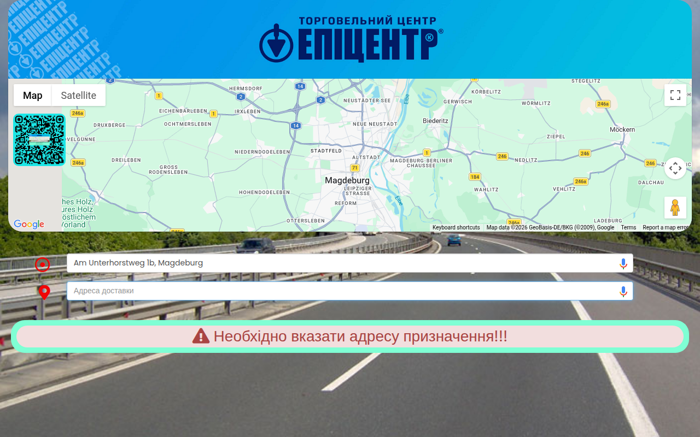

# GoogleMAPsDelivery

<!-- AUTOGEN:STATS -->
       

## 📸 Latest Screenshot

<!-- END:AUTOGEN -->

# Планувальник маршрутів доставки (Google Maps)

Легкий інструмент для розрахунку та візуалізації маршрутів доставки з використанням Google Maps API.

## Можливості

- Інтерактивна мапа з візуалізацією маршруту
- Планування маршруту з багатьма зупинками
- Розрахунок відстані та часу в дорозі
- Адаптивний дизайн для мобільних пристроїв та ПК

## Використання

1. Відкрийте [живу демо-версію](https://vutov-mykola.github.io/googlemapsdelivery/)
2. Додайте адреси доставки
3. Перегляньте оптимізований маршрут на мапі
4. Оцініть приблизний час та відстань

## Використані технології

- Google Maps JavaScript API
- HTML5/CSS3
- Vanilla JavaScript

## Ліцензія

MIT
